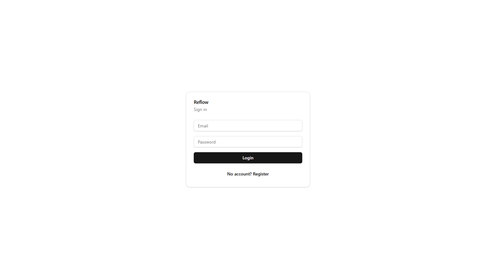
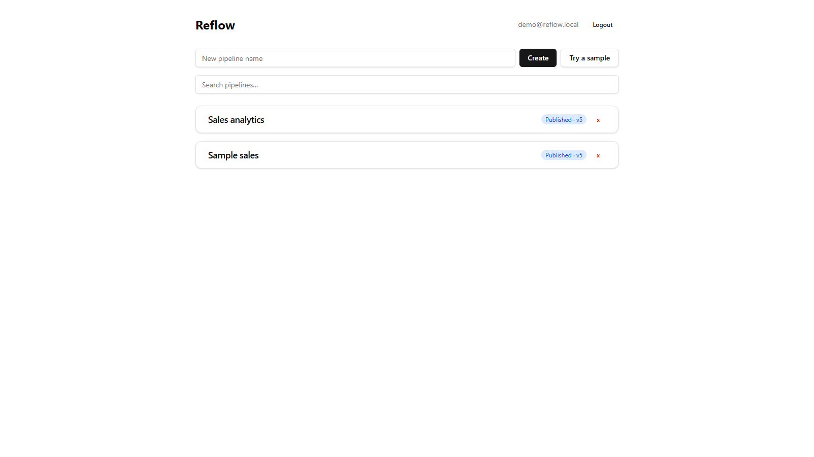
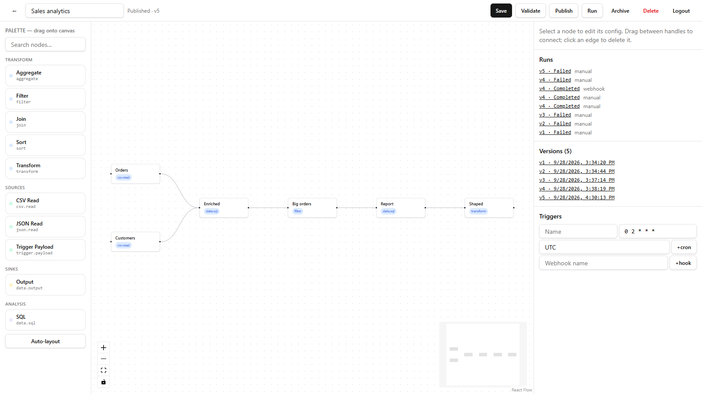
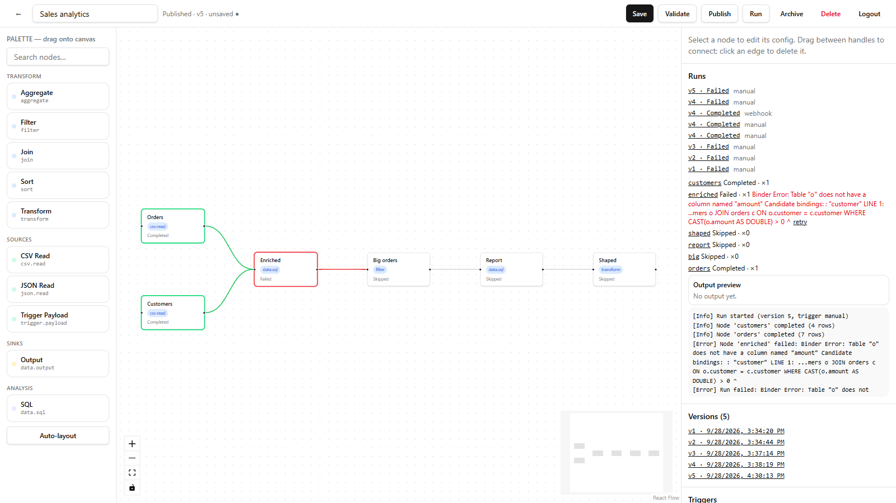

# Reflow — Visual Data Pipeline Orchestration

[](https://github.com/jasserhouimli/Reflow/actions/workflows/ci.yml)

Reflow is a visual data pipeline orchestration platform. Data engineers design a
DAG of nodes on a canvas, publish an immutable version, then trigger runs
(manually, on a cron schedule, or via webhook) that execute with retries, logs,
and full run inspection.



## Preview

### Pipelines dashboard



### Visual canvas — drag nodes, connect handles, guided configs



### Live runs — per-node status, output preview, logs, versions



## How it works

```text
Canvas (React Flow, palette from GET /api/node-types)
        ↓  save / validate / publish (immutable version)
Trigger (manual / cron / webhook, idempotent)
        ↓
Pipeline run → DAG execution engine (wake-up pulses, atomic claims, bounded retries)
        ↓  live runChanged pushes over SignalR
Node handlers → DuckDB SQL (filter/transform/aggregate/join/sort)
        ↓
Task outputs, attempts, logs, artifacts, lineage-ready metadata
```

Triggers start runs; they never execute pipelines inline. Webhook events are
persisted and deduplicated on `(trigger, external event id)`. Tables in
`data.sql` are named after their source nodes (`FROM orders o JOIN customers c`).

## Triggers

```text
POST /api/v1/pipelines/{id}/triggers/schedules   { name, cron, timezone, overlap }
POST /api/v1/pipelines/{id}/triggers/webhooks    → { token } (shown once)
POST /api/v1/hooks/{token}                       inbound JSON → 202 { id }
```

- Schedules use 5-field cron plus timezone, `skip`/`queue` overlap policies,
  and a background worker with queue caps.
- Webhook URLs embed a secret token (SHA-256 at rest, regenerable). The body
  becomes the run payload (600 KB cap, must be JSON).
- Idempotency: send `X-Event-Id` (or an `eventId` field) and replays return the
  original run instead of starting a duplicate.
- Inside a pipeline, a `trigger.payload` node (optional `rootPath`) parses the
  payload so downstream SQL can query it like any table.

## Tech

- .NET 10, ASP.NET Core Minimal APIs (no controllers), vertical slices
- PostgreSQL + Entity Framework Core (control plane; one schema per module)
- DuckDB (analytical SQL), JWT auth over HttpOnly cookies, FluentValidation
- Serilog, Swagger (dev), Cronos (schedules), SignalR (live runs), xUnit (81 unit + 25 API tests)
- React 19 + TypeScript + Vite + Tailwind + React Flow

## Architecture

- Modular monolith; each module owns its data and EF schema
- Cross-module calls only through explicit contracts
  (`IPipelineSnapshotProvider`, `IPipelineAccessChecker`, `IPipelineRunStarter`,
  `IRunMonitor`) — never direct table access
- Node types are independent slices (type id, editor definition, config
  validation, SQL-compiling execution, registration, tests); the engine
  resolves them through a registry with no type switches

| Module | Responsibility | Status |
|--------|---------------|--------|
| Identity | Register, login, JWT + refresh, `/auth/me` | Done |
| Pipelines | CRUD, DAG validation, immutable versions, publish/archive | Done |
| NodeTypes | Registry, `GET /api/node-types`, 10 slices (sources, shaping, SQL, sinks) | Growing |
| DataProcessing | Frame abstractions, CSV/JSON codecs, DuckDB engine, artifacts, catalog, quality, lineage | Core done |
| PipelineExecution | Runs, attempts, logs, worker, retries, cancel, recovery | Done |
| Triggers | Cron schedules, idempotent webhooks, scheduler worker | Done |

## Getting started

Prerequisites: .NET 10 SDK, PostgreSQL 16+, Node 22+.

```bash

#Migrate each control-plane schema
dotnet ef database update --context IdentityDbContext --project src/Reflow.Api
dotnet ef database update --context PipelinesDbContext --project src/Reflow.Api
dotnet ef database update --context PipelineExecutionDbContext --project src/Reflow.Api
dotnet ef database update --context TriggersDbContext --project src/Reflow.Api

#Run backend + frontend (or .\dev.ps1)
dotnet run --project src/Reflow.Api --urls http://localhost:5001
cd frontend && npm install && npm run dev   # http://localhost:5173
```

## API cheatsheet

```text
POST /api/v1/pipelines                  create pipeline
PUT  /api/v1/pipelines/{id}             save graph (nodes/edges)
POST /api/v1/pipelines/{id}/validate    DAG + config validation
POST /api/v1/pipelines/{id}/publish     freeze immutable version
POST /api/v1/pipelines/{id}/runs        start run → 202 { id }
GET  /api/v1/runs/{id}                  run status
GET  /api/v1/runs/{id}/tasks            task states
GET  /api/v1/runs/{id}/logs             execution logs
GET  /api/v1/tasks/{id}                 task detail incl. output JSON
POST /api/v1/tasks/{id}/retry           retry failed task
GET  /api/node-types                    editor palette definitions
POST /api/v1/hooks/{token}              inbound webhook → 202 (idempotent)
```

## Node types

| Type | What it does |
|------|--------------|
| `csv.read` | Parse CSV text into a table |
| `json.read` | Parse JSON text or unpack an upstream JSON column |
| `trigger.payload` | Parse the run's webhook/schedule payload |
| `filter` | `WHERE` predicate compiled to SQL (8 operators) |
| `transform` | `SELECT` / `EXCLUDE` / `RENAME` compiled to SQL |
| `aggregate` | `GROUP BY` + count/distinct/sum/avg/min/max |
| `sort` | Multi-key `ORDER BY` |
| `join` | Inner/left join on shared or distinct keys |
| `data.sql` | Free-form DuckDB SQL over node-named tables |
| `data.output` | Save downloadable JSON/CSV run artifact |

## Testing

```bash
dotnet test        # unit + API integration (needs Postgres, creates reflow_test)
cd frontend && npm run build
```

## Roadmap

Architecture boundary tests in CI → Arrow interchange + Parquet artifacts →
Connections (DB sinks by reference, not credentials) → Docker Compose →
dataset catalog persistence + lineage UI.
